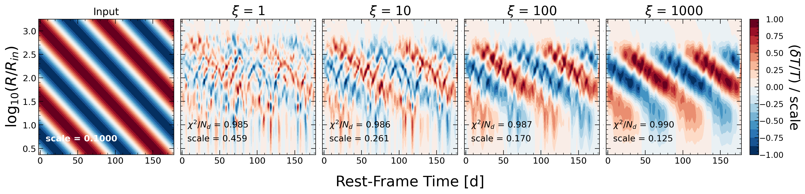

# TempMap

A package following Stone & Shen (2023) in using the method described in Neustadt & Kochanek (2022) (NK22) to form temperature perturbation maps for AGN accretion disks. The methodology is originally described in NK22, with small adjustments in Stone & Shen (2023). 

The repository is organized as follows:
* `/src` - The python package
* `/Examples` - Example Jupyter notebooks detailing three use cases for the package (for both simulated and real data)
* `/Paper` - Results from Stone & Shen (2022), including GIFs of fit spectra

## The Algorithm
Temperature perturbations generated within the accretion disks of AGN, near the supermassive black hole (SMBH), can generate changes in observed flux in the optical wavelengths. Assuming a Shakura-Sunayev thin disk (Shakura & Sunayev, 1973), axisyemmetric raduation, and a linear relationsship between perturbations in temperature $\delta T$ and flux $\delta F_\lambda$, flux variability can be derived from an integral of temperature perturbations over the entire disk. Doing this for multiple observed times $t_d$ produces a map of flux perturbations as a function of wavelength $\lambda$ and time. This process can be inverted to use input flux data to produce output temperature perturbation maps, in terms of radius and time. In addition, for large AGN, there is a time delay between emission at different points in the disk which could arrive at the same time. This "smearing effect" is also taken into account in the model.

To produce output temperature perturbation maps, one needs to use multi-wavelength and multi-epoch AGN variability data. NK22 use multi-wavelength light curves for local AGN, while we use multi-epoch SDSS-RM spectra for a range of different redshifts. In this package, there are a number of different test cases that can be used to test the algorithm, including fast, lamppost-like, outgoing waves (_outgo_) and slow, inward-moving wave-like perturbations (_ingo_) (see `/Examples/SimData_Tutorial.ipynb`). The package can also be used with user-input data (see `/Examples/RealData_Tutorial.ipynb`). Both of these examples assume that that each spetrum is sampled at the same wavelengths $\lambda$. For arbitrarily sampled data, there is another test of the algorithm using light curve data from NGC5548 (see  `/Examples/ArbitrarilySampledData_Tutorial.ipynb`).

The algorithm can output a temperature map for an arbitrary number of specified "smoothing" parameters $\xi$:

and also show the quality of the fit to the data with an animated GIF:

## Data and Contact
[ArXiv](https://arxiv.org/abs/2210.07452)

All data for the SDSS-RM sample used in this paper (including spectra and AGN paramaters), as well as all output temperature maps are located on [Zenodo](https://zenodo.org/record/7195997)

For any questions or comments, reach out to [Zachary Stone](mailto:stone28@illinois.edu) or [Yue Shen](mailto:shenyue@illinois.edu)
